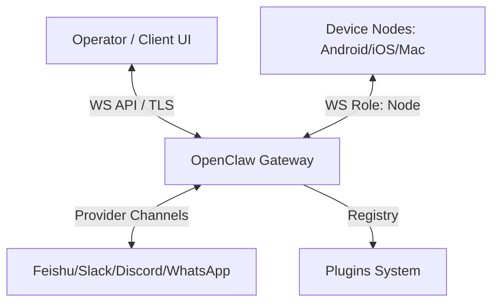

# OpenClaw Architecture

This document provides a high-level reference for the OpenClaw system architecture, messaging pathways, capability boundaries, and config management infrastructure.

---

## 1. System Overview



- **OpenClaw Gateway**: A single, long-lived server/daemon that owns all provider messaging surfaces (Slack, Discord, Feishu, WhatsApp, etc.). It acts as the orchestration and control plane.
- **WebSocket API**: High-performance, schema-validated WebSocket gateway where clients (TUI, Control UI, operators) and hardware nodes connect with specific roles and capabilities.
- **Nodes**: Connected devices (role: `node`) executing device-specific actions (e.g. `camera.snap`, `screen.record`, `canvas.host`).
- **Plugins**: Modular capability extensions registering model providers, speech synthesis, tools, hooks, or CLI commands.

---

## 2. Plugin Capability and Ownership Boundaries

OpenClaw enforces a strict capability-based extension model:

- **Core stays extension-agnostic**: Standard seams exist under `openclaw/plugin-sdk/*`. Core features do not import deep plugin internals.
- **Plugin Shape Classification**: Plugins are classified as `plain-capability`, `hybrid-capability`, `hook-only`, or `non-capability`.
- **Capability Layering**:
  - **Core Layer**: Shared orchestration, fallback pipelines, and schema validation contracts.
  - **Vendor Plugin Layer**: API integrations, custom OAuth auth profiles, and provider-specific model catalogs.
  - **Channel/Feature Layer**: Platform integrations that consume generic core capability APIs instead of talking directly to vendors.

---

## 3. Slash Command Infrastructure

Slash commands in OpenClaw are processed by the Gateway and route to specific command handlers based on prefix matching.

### 3.1 Command Parsing & Subcommand Routing

1. Standalone chat messages starting with `/` (or directive-only lines) are matched at the Gateway entrance.
2. In `src/auto-reply/reply/commands-slash-parse.ts`, the prefix is normalized and the string splits via regex (`/^(\S+)(?:\s+([\s\S]+))?$/`) into `action` and `args`.
3. In `src/auto-reply/reply/commands-config.ts`, `/config` routes to `handleConfigCommand`, supporting subcommands:
   - `show`: Formats and displays the current raw configuration or a value at a target dot-notation path.
   - `set`: Assigns a validated value to the specified path, executes a validation pass via schemas/active plugins, and persists updates back to `openclaw.json`.
   - `unset`: Removes a property from the configuration tree, validates the mutated state, and writes the outcome back to the disk.

### 3.2 Command Gating & Access Control

All Gateway slash commands are protected by layered security gates:

- `rejectUnauthorizedCommand`: Verifies if the sender is allowlisted.
- `rejectNonOwnerCommand`: Ensures owner-only configuration write methods (`/config`, `/debug`, `/mcp`, `/plugins`) are only accessible to accounts matching `commands.ownerAllowFrom`.
- `requireCommandFlagEnabled`: Confirms that the command category is globally enabled under `commands.*` in `openclaw.json`.
- `requireGatewayClientScopeForInternalChannel`: Gated write actions require explicit `operator.admin` client scopes.

---

## 4. Config Path Traversal Mechanics & Array Limitations

### 4.1 Path Traversal Algorithms

Config path manipulation is defined in `src/config/config-paths.ts`:

- `parseConfigPath(raw)` splits the target string solely by the `.` dot separator.
- `getConfigValueAtPath(root, path)` traverses the nested object structure using the token array.
- `setConfigValueAtPath(root, path, value)` dynamically materializes sub-objects where missing and places the target value at the leaf.
- `unsetConfigValueAtPath(root, path)` removes the leaf key and recursively cleans up empty ancestor nodes.

### 4.2 Array Traversal Limitation

A critical design constraint exists in the path traversal logic when dealing with arrays:

```typescript
export function getConfigValueAtPath(root: PathNode, path: string[]): unknown {
  let cursor: unknown = root;
  for (const key of path) {
    if (!isPlainObject(cursor)) {
      return undefined;
    }
    cursor = cursor[key];
  }
  return cursor;
}
```

- The traversal strictly uses `isPlainObject(cursor)` as a guard condition before key lookup.
- `isPlainObject` is explicitly designed to reject arrays:

```typescript
export function isPlainObject(value: unknown): value is Record<string, unknown> {
  return (
    typeof value === "object" &&
    value !== null &&
    !Array.isArray(value) &&
    Object.prototype.toString.call(value) === "[object Object]"
  );
}
```

- Because of this, when `cursor` reaches an array (such as `agents.list` in `openclaw_conf.json`), `isPlainObject(cursor)` evaluates to `false`.
- The traversal halts and immediately returns `undefined`.
- Consequently, dot-notation or bracket-notation index accessors (such as `agents.list.0.id` or `agents.list[0].id`) **cannot** be parsed or traversed using the `/config` slash command directly.

### 4.3 Recommended Workaround

To read or modify array-indexed entries (like the first agent's ID):

1. **To View**: Read the entire parent array:
   ```text
   /config show agents.list
   ```
   This retrieves the entire JSON array, allowing you to manually inspect index `0` of the list (e.g. `{ "id": "steward", "default": true, ... }`).
2. **To Modify**: Perform the modifications on disk inside `openclaw.json` directly, or query the configuration using an external workspace tool where structured JSON parsers can directly address index positions.
